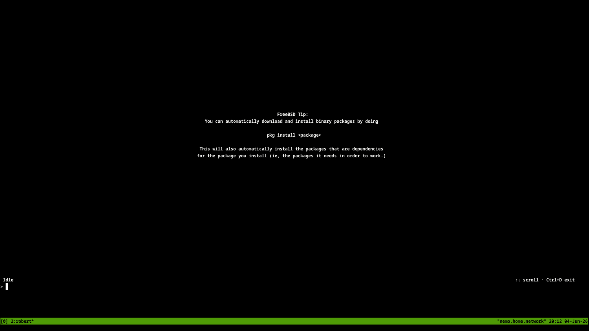
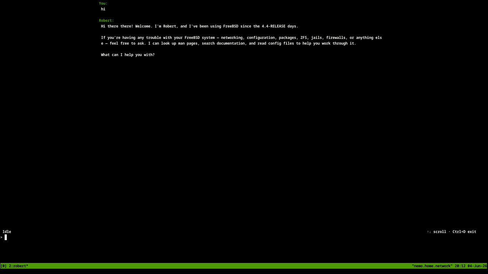
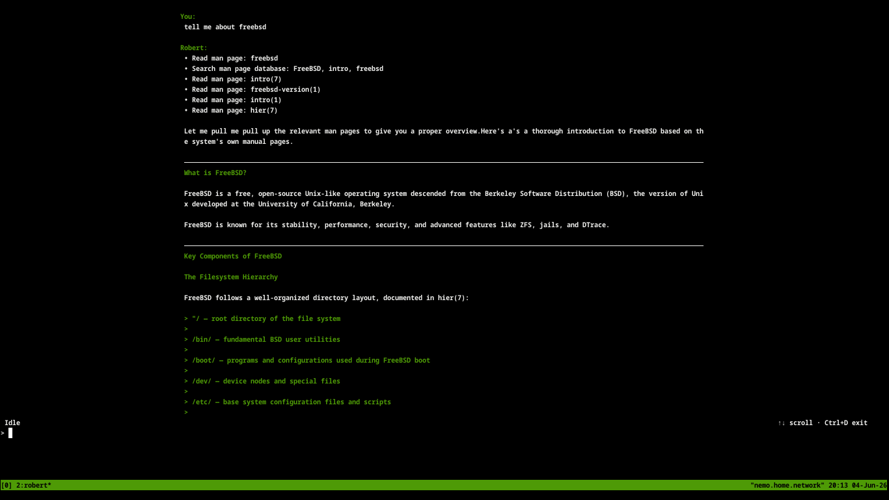
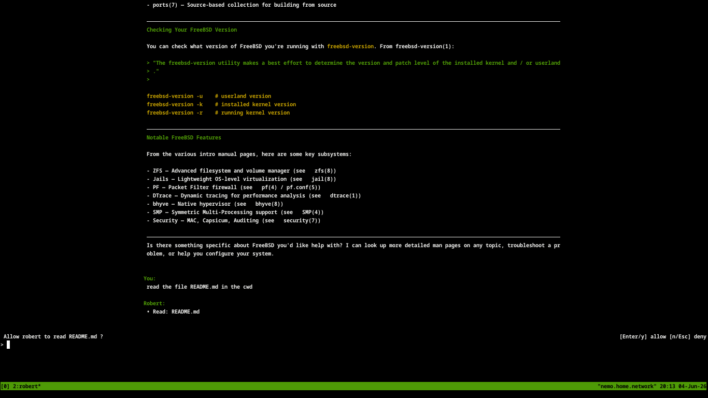

## About

**Who is Robert?**

Robert has been using FreeBSD since the early 2000s,
and the first release he installed was 4.4-RELEASE.
He is an expert at reading and searching manual pages,
and sometimes he can read files.

**What is Robert?**

Robert is Artificial Intelligence packaged as a
native, 2MB FreeBSD binary. It currently requires
DeepSeek because it is almost free to use but
_it could_ also work with other providers.

## Appearance

**Boot**

The boot screen runs `fortune freebsd-tips`  
Similar to the default FreeBSD default `${HOME}/.profile`.

**First turn**

Simple greeting.

**Second turn**

Question answered from the FreeBSD man pages.

**Tool confirmation**

No confirmation required to read, or search man pages.  
Confirmation required to read files.

## ASCIICast

## License

0BSD. See [LICENSE](LICENSE).
